# Python 自动注册技术方案

## 方案概述

基于 **Python + CDP + 临时邮箱 API** 的全自动网站账号注册方案。核心思路是三个协议的配合：

| 协议 | 用途 |
|------|------|
| **CDP**（Chrome DevTools Protocol） | 控制浏览器，模拟用户操作 |
| **HTTPS** | 与目标网站交互 |
| **REST API** | 通过 Mail.tm 收取验证邮件 |

Python 作为中间调度层，串联起整个流程。

---

## 技术栈

| 组件 | 技术选型 | 说明 |
|------|----------|------|
| 语言 | Python 3.x | 中间调度层 |
| 浏览器控制 | CDP (Chrome DevTools Protocol) | WebSocket 连接 Chrome |
| 临时邮箱 | Mail.tm REST API | 创建临时邮箱、接收验证邮件 |
| 指纹伪装 | JS 注入 | 通过 CDP 注入反检测脚本 |
| 验证码 | 正则提取 | 从邮件中提取验证链接 |

---

## 完整执行流程

```mermaid
graph LR
    subgraph Step1["Step 1: 初始化"]
        A1[创建临时邮箱]
        A2[Mail.tm API]
        A3[获取 Token]
    end

    subgraph Step2["Step 2: 注册"]
        B1[打开注册页面]
        B2[注入指纹伪装]
        B3[模拟人类填写]
        B4[提交注册表单]
    end

    subgraph Step3["Step 3: 验证"]
        C1[轮询 Mail.tm]
        C2[读取验证邮件]
        C3[正则提取链接]
        C4[访问验证 URL]
    end

    Step1 -->|POST /accounts\nPOST /token| Step2
    Step2 -->|CDP: Page.navigate\nCDP: DOM.querySelector\nCDP: Input.dispatch*\nCDP: Page.addScript| Step3

    style Step1 fill:#0f3460,stroke:#e94560,color:#fff
    style Step2 fill:#1a3a5c,stroke:#e94560,color:#fff
    style Step3 fill:#1e4d6b,stroke:#e94560,color:#fff
```

---

## 四、各步骤详细说明

### Step 1：初始化 — 创建临时邮箱

**目标：** 获取一个可用的临时邮箱地址和访问 Token。

**API 调用：**

```
POST https://api.mail.tm/accounts
Body: { "address": "<随机用户名>@<可用域名>", "password": "<密码>" }

POST https://api.mail.tm/token
Body: { "address": "<邮箱地址>", "password": "<密码>" }
```

**数据流：**

```
Python → HTTPS → Mail.tm API → 返回邮箱地址 + Token
```

**输出：** 临时邮箱地址、JWT Token

---

### Step 2：注册 — 模拟用户填写表单

**目标：** 在目标网站完成注册表单的填写和提交。

**CDP 命令序列：**

| 序号 | CDP 方法 | 用途 |
|------|----------|------|
| 1 | `Page.addScriptToEvaluateOnNewDocument` | 注入指纹伪装脚本 |
| 2 | `Page.navigate` | 打开目标注册页面 |
| 3 | `DOM.querySelector` | 定位表单输入框 |
| 4 | `Input.dispatchKeyEvent` | 模拟键盘输入 |
| 5 | `Input.dispatchMouseEvent` | 模拟鼠标点击提交 |

**数据流：**

```
页面控制：Python → WebSocket(CDP) → Chrome → HTTPS → 目标网站
指纹注入：Python → CDP(Page.addScriptToEvaluateOnNewDocument) → Chrome JS引擎
```

**关键点：**
- 指纹伪装脚本需在页面加载前注入
- 输入操作需模拟人类行为（随机延迟、逐字输入）
- 使用 `Input.dispatch*` 而非直接修改 DOM 值

---

### Step 3：验证 — 获取并访问验证链接

**目标：** 从临时邮箱获取验证邮件，提取验证链接并访问完成注册。

**API 调用：**

```
GET https://api.mail.tm/messages
Headers: { "Authorization": "Bearer <token>" }

GET https://api.mail.tm/messages/{id}
Headers: { "Authorization": "Bearer <token>" }
```

**数据流：**

```
邮件读取：Python → HTTPS → Mail.tm API → 返回邮件内容
链接验证：Python → CDP(Page.navigate) → Chrome → HTTPS → 目标网站验证接口
```

**关键点：**
- 需要轮询等待邮件到达（设置超时机制）
- 使用正则表达式从邮件 HTML 中提取验证链接
- 通过 CDP 控制浏览器访问验证链接

---

## 五、数据流总览

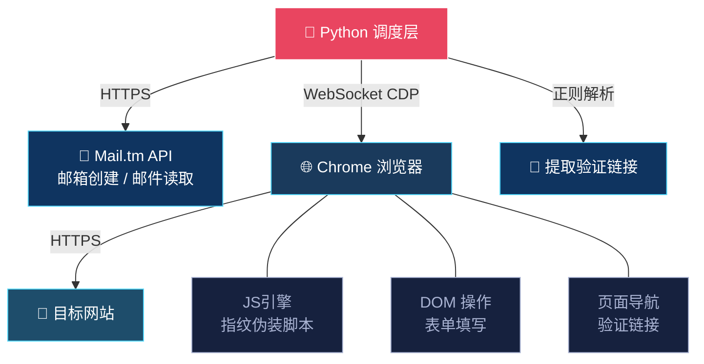

| 步骤 | 数据流 |
|------|--------|
| 邮箱创建 | `Python → HTTPS → Mail.tm API → 返回邮箱地址 + Token` |
| 页面控制 | `Python → WebSocket(CDP) → Chrome → HTTPS → 目标网站` |
| 指纹注入 | `Python → CDP(Page.addScriptToEvaluateOnNewDocument) → Chrome JS引擎` |
| 邮件读取 | `Python → HTTPS → Mail.tm API → 返回邮件内容` |
| 链接验证 | `Python → CDP(Page.navigate) → Chrome → HTTPS → 目标网站验证接口` |

---

## 六、核心协议配合

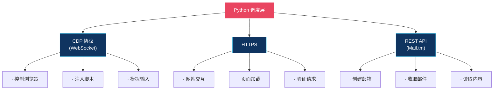

---

## 七、关键技术要点

### 7.1 指纹伪装

通过 `Page.addScriptToEvaluateOnNewDocument` 在页面加载前注入 JS 脚本，覆盖浏览器指纹信息：

- `navigator.webdriver` → `false`
- `navigator.plugins` → 模拟真实插件列表
- Canvas / WebGL 指纹随机化
- `window.chrome` 属性伪装

### 7.2 人类行为模拟

- **输入延迟：** 每个按键之间添加 50-150ms 随机延迟
- **鼠标移动：** 贝塞尔曲线模拟自然移动轨迹
- **操作间隔：** 各步骤之间添加随机等待时间

### 7.3 邮件轮询策略

```
最大等待时间: 60s
轮询间隔: 3-5s
超时处理: 重试或标记失败
```

---

## 八、风险与注意事项

| 风险 | 应对措施 |
|------|----------|
| IP 封禁 | 使用代理池轮换 IP |
| 验证码 | 接入打码平台或 AI 识别 |
| 指纹检测 | 定期更新伪装脚本 |
| 邮箱服务不可用 | 备用临时邮箱服务 |
| 注册频率限制 | 控制注册速度，添加随机延迟 |

---

## 附录：Mermaid 支持的图表类型

> 以下图表类型均可在飞书文档的代码块中使用（语言选择 `Mermaid`）。

### 1. 流程图（Flowchart）

适用场景：步骤流程、决策分支、系统架构

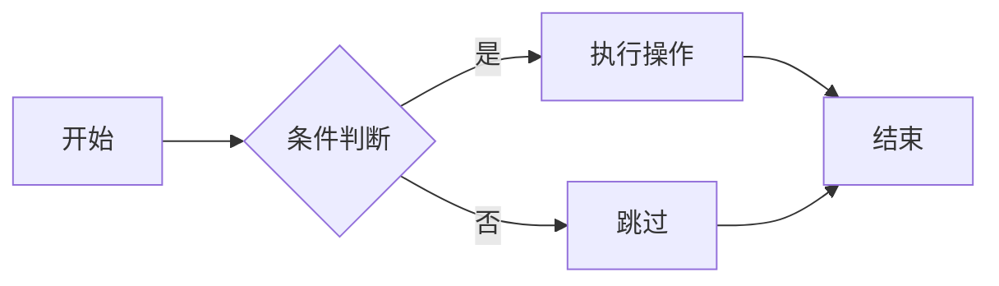

### 2. 时序图（Sequence Diagram）

适用场景：API 调用顺序、组件间交互、通信协议

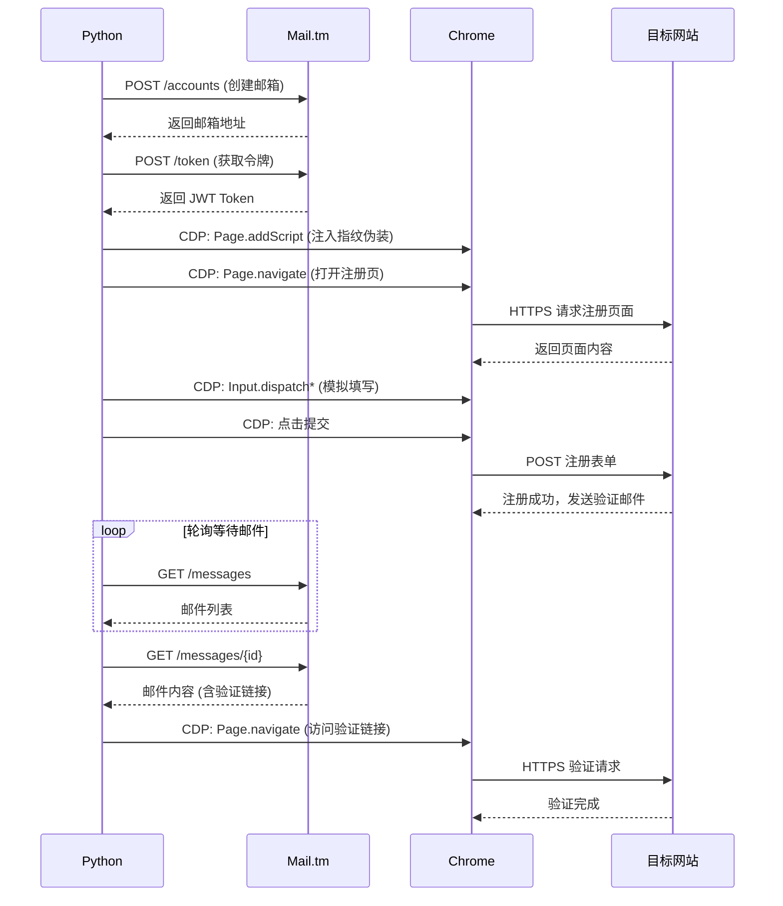

### 3. 类图（Class Diagram）

适用场景：面向对象设计、数据模型、接口定义

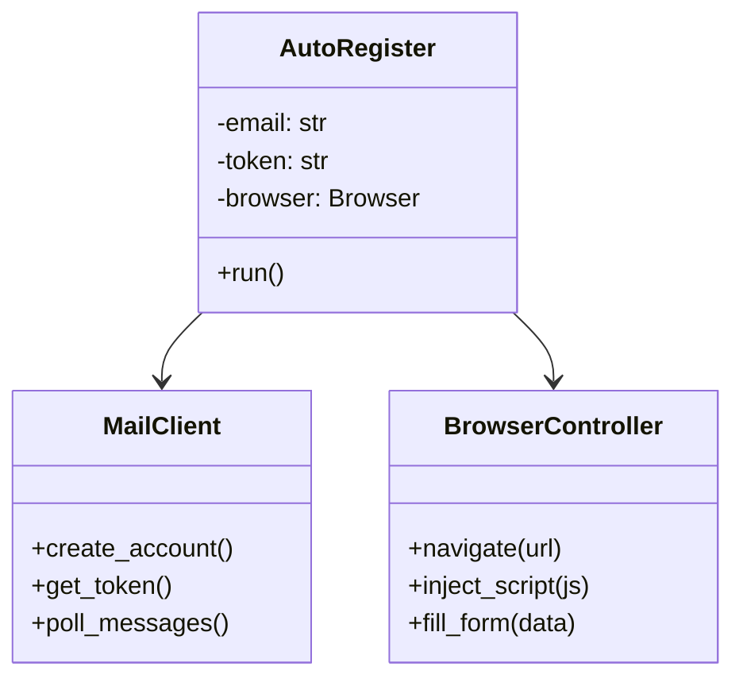

### 4. 状态图（State Diagram）

适用场景：状态机、对象生命周期、任务状态流转

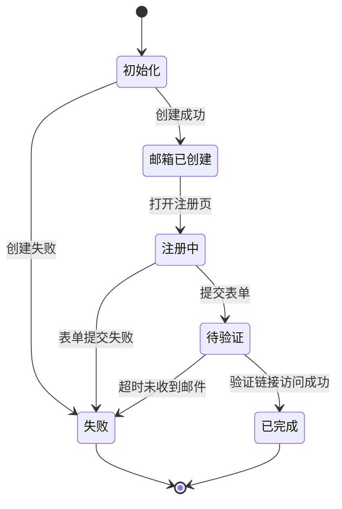

### 5. 甘特图（Gantt）

适用场景：项目排期、任务时间规划、里程碑管理

```mermaid
gantt
    title 自动注册流程耗时
    dateFormat ss
    axisFormat %S秒

    section 初始化
    创建邮箱        :a1, 00, 2s
    获取 Token      :a2, after a1, 1s

    section 注册
    注入指纹伪装     :b1, after a2, 1s
    打开注册页面     :b2, after b1, 3s
    模拟填写表单     :b3, after b2, 5s
    提交注册        :b4, after b3, 2s

    section 验证
    轮询等待邮件     :c1, after b4, 10s
    提取验证链接     :c2, after c1, 1s
    访问验证 URL    :c3, after c2, 2s
```

### 6. 饼图（Pie Chart）

适用场景：比例分布、占比统计

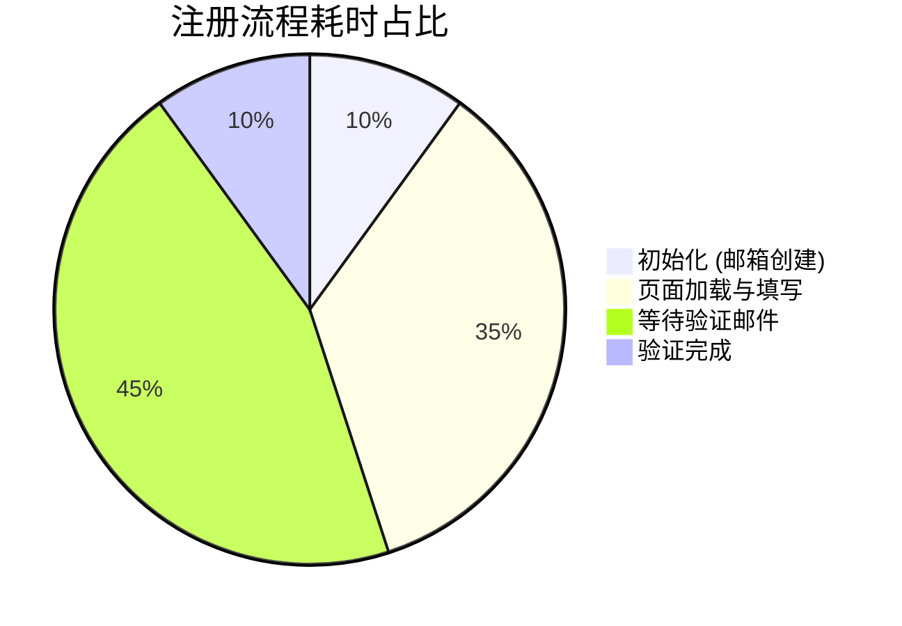

### 7. ER 图（Entity Relationship Diagram）

适用场景：数据库表关系、数据结构设计

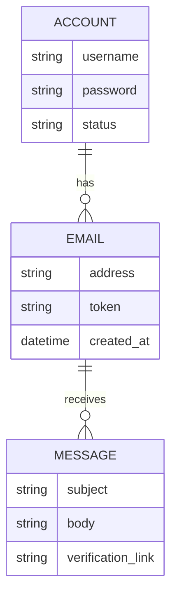

### 8. 思维导图（Mindmap）

适用场景：知识结构梳理、头脑风暴、技术拆解

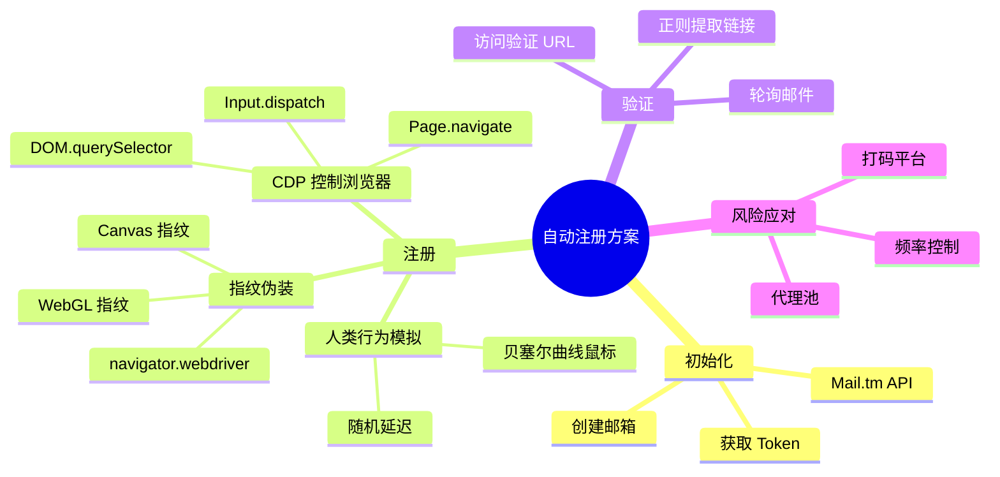

### 9. 时间线（Timeline）

适用场景：项目里程碑、版本演进历史

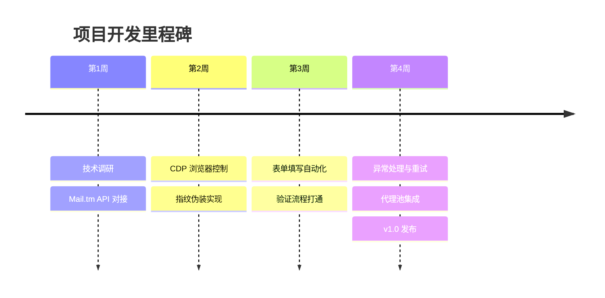

### 图表类型速查表

| 类型 | 语法关键字 | 适用场景 |
|------|----------|---------|
| 流程图 | `graph` / `flowchart` | 步骤流程、决策分支 |
| 时序图 | `sequenceDiagram` | API 调用顺序、组件交互 |
| 类图 | `classDiagram` | 面向对象设计、数据模型 |
| 状态图 | `stateDiagram-v2` | 状态机、生命周期 |
| 甘特图 | `gantt` | 项目排期、时间规划 |
| 饼图 | `pie` | 比例分布 |
| ER 图 | `erDiagram` | 数据库表关系 |
| 思维导图 | `mindmap` | 知识结构、头脑风暴 |
| 时间线 | `timeline` | 里程碑、版本演进 |
| 桑基图 | `sankey-beta` | 数据流向、资源分配 |
| 框图 | `block-beta` | 系统架构、模块组成 |
