# 飞书文档支持的图表类型

本文整理当前项目中适合写入飞书文档的图表类型，分为两部分：

- Mermaid 图表
- 基础 UML / PlantUML 图表

## 文档编写要求

- Mermaid 图表通过飞书白板 API 以 Mermaid 语法导入
- UML 图表通过飞书白板 API 以 PlantUML 语法导入
- 下面示例主要用于整理可用图表类型与基础语法，不代表飞书一定支持对应语法的全部高级特性
- 如果希望导入后的飞书文档同时保留“源码 + 预览图表”，推荐每个图表都拆成两段：先放源码代码块，再放预览代码块

---

## 统一导入方式：源码 + 预览

如果希望飞书文档中的每个图表都包含两部分，推荐统一使用下面的结构：

1. `源码`
   使用普通代码块，保留原始文本
2. `预览图表`
   使用 `mermaid` 或 `plantuml` 代码块，由写入器转换为飞书画板

### Mermaid 推荐模板

````markdown
源码：

```
graph LR
    A[开始] --> B[结束]
```

预览图表：


````

### PlantUML 推荐模板

````markdown
源码：

```
@startuml
class User
class MailClient
User --> MailClient
@enduml
```

预览图表：

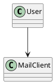
````

### 实施建议

- `源码` 部分直接使用普通代码块 ` ``` ` 即可，保留原始文本
- `预览图表` 部分 Mermaid 使用 `mermaid`，PlantUML 使用 `plantuml`
- 文档中的每种图表都按同样模式组织：`适用场景 -> 源码 -> 预览图表`
- 如果只想保留预览、不保留源码，则只写第二段图表块

---

## 示例结构

下面的 Mermaid / PlantUML 图表类型清单，均建议按上面的“源码 + 预览”双段结构组织。

---

## 一、Mermaid 支持的图表类型

> 以下内容整理自 [Python自动注册技术方案.md](/Users/wade/MyDocument/ScriptCode/feishu-docx/docs/Python自动注册技术方案.md) 附录部分。

### Mermaid 图表速查表

| 类型 | 语法关键字 | 适用场景 |
|------|----------|---------|
| [流程图](#mermaid-flowchart) | `graph` / `flowchart` | 步骤流程、决策分支 |
| [时序图](#mermaid-sequence) | `sequenceDiagram` | API 调用顺序、组件交互 |
| [类图](#mermaid-class) | `classDiagram` | 面向对象设计、数据模型 |
| [状态图](#mermaid-state) | `stateDiagram-v2` | 状态机、生命周期 |
| [甘特图](#mermaid-gantt) | `gantt` | 项目排期、时间规划 |
| [饼图](#mermaid-pie) | `pie` | 比例分布 |
| [ER 图](#mermaid-er) | `erDiagram` | 数据库表关系 |
| [思维导图](#mermaid-mindmap) | `mindmap` | 知识结构、头脑风暴 |
| [时间线](#mermaid-timeline) | `timeline` | 里程碑、版本演进 |

<a id="mermaid-flowchart"></a>
### 1. 流程图（Flowchart）

适用场景：步骤流程、决策分支、系统架构

源码：

```
graph LR
    A[开始] --> B{条件判断}
    B -->|是| C[执行操作]
    B -->|否| D[跳过]
    C --> E[结束]
    D --> E
```

预览图表：

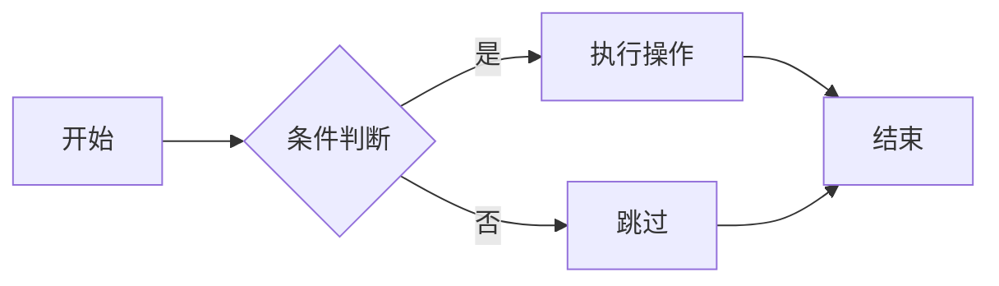

<a id="mermaid-sequence"></a>
### 2. 时序图（Sequence Diagram）

适用场景：API 调用顺序、组件间交互、通信协议

源码：

```
sequenceDiagram
    participant P as Python
    participant M as Mail.tm
    participant C as Chrome
    participant T as 目标网站

    P->>M: 创建邮箱
    M-->>P: 返回邮箱地址
    P->>C: 打开注册页
    C->>T: 请求注册页面
    T-->>C: 返回页面内容
    P->>C: 模拟填写表单
    P->>C: 点击提交
    T-->>C: 发送验证邮件
```

预览图表：

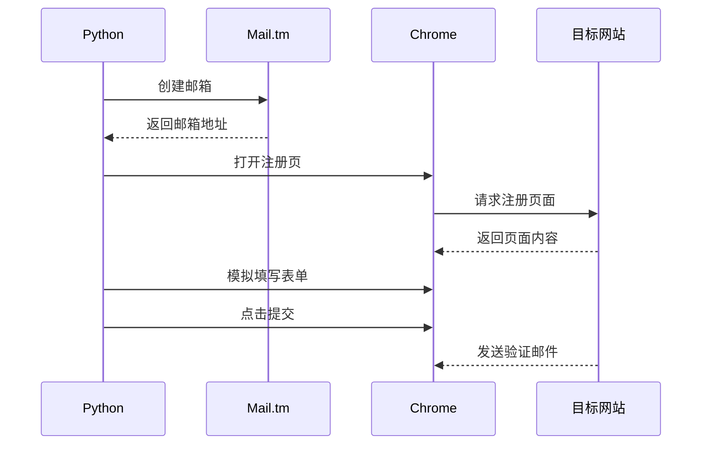

<a id="mermaid-class"></a>
### 3. 类图（Class Diagram）

适用场景：面向对象设计、数据模型、接口定义

源码：

```
classDiagram
    class AutoRegister {
        -email: str
        -token: str
        +run()
    }
    class MailClient {
        +create_account()
        +get_token()
    }
    class BrowserController {
        +navigate(url)
        +fill_form(data)
    }
    AutoRegister --> MailClient
    AutoRegister --> BrowserController
```

预览图表：

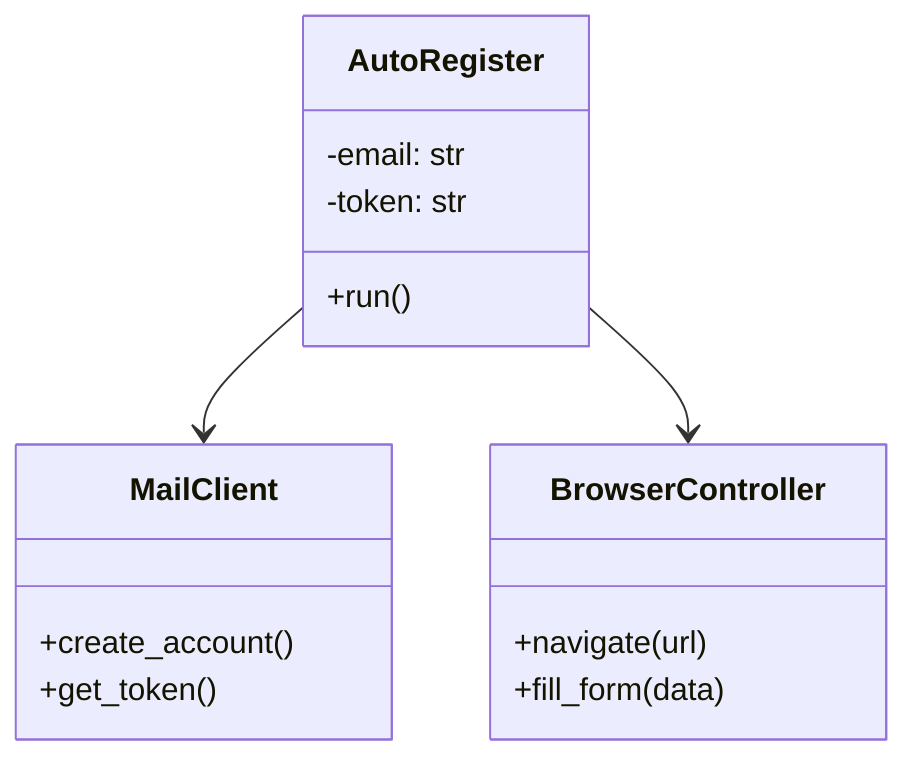

<a id="mermaid-state"></a>
### 4. 状态图（State Diagram）

适用场景：状态机、对象生命周期、任务状态流转

源码：

```
stateDiagram-v2
    [*] --> 初始化
    初始化 --> 注册中
    注册中 --> 待验证
    待验证 --> 已完成
    待验证 --> 失败
    失败 --> [*]
    已完成 --> [*]
```

预览图表：

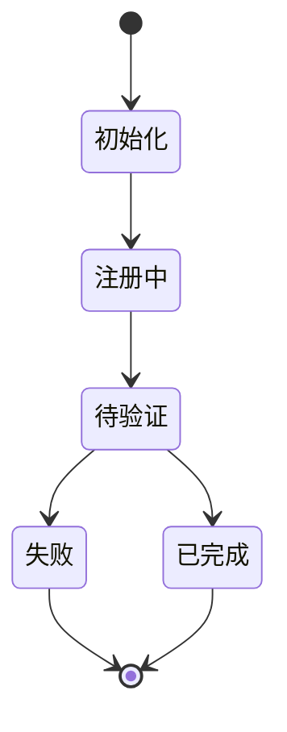

<a id="mermaid-gantt"></a>
### 5. 甘特图（Gantt）

适用场景：项目排期、任务时间规划、里程碑管理

源码：

```
gantt
    title 自动注册流程耗时
    dateFormat ss
    axisFormat %S秒

    section 初始化
    创建邮箱        :a1, 00, 2s
    获取 Token      :a2, after a1, 1s

    section 注册
    打开注册页面     :b1, after a2, 3s
    模拟填写表单     :b2, after b1, 5s

    section 验证
    轮询等待邮件     :c1, after b2, 10s
```

预览图表：

```mermaid
gantt
    title 自动注册流程耗时
    dateFormat ss
    axisFormat %S秒

    section 初始化
    创建邮箱        :a1, 00, 2s
    获取 Token      :a2, after a1, 1s

    section 注册
    打开注册页面     :b1, after a2, 3s
    模拟填写表单     :b2, after b1, 5s

    section 验证
    轮询等待邮件     :c1, after b2, 10s
```

<a id="mermaid-pie"></a>
### 6. 饼图（Pie Chart）

适用场景：比例分布、占比统计

源码：

```
pie title 注册流程耗时占比
    "初始化" : 10
    "页面加载与填写" : 35
    "等待验证邮件" : 45
    "验证完成" : 10
```

预览图表：

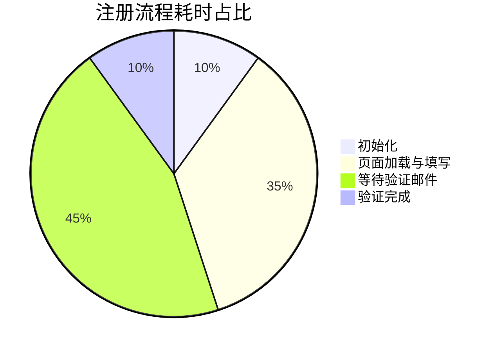

<a id="mermaid-er"></a>
### 7. ER 图（Entity Relationship Diagram）

适用场景：数据库表关系、数据结构设计

源码：

```
erDiagram
    ACCOUNT ||--o{ EMAIL : has
    EMAIL ||--o{ MESSAGE : receives
```

预览图表：

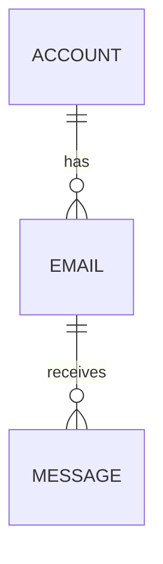

<a id="mermaid-mindmap"></a>
### 8. 思维导图（Mindmap）

适用场景：知识结构梳理、头脑风暴、技术拆解

源码：

```
mindmap
  root((自动注册方案))
    初始化
      创建邮箱
      获取 Token
    注册
      打开注册页
      提交注册表单
    验证
      轮询邮件
      访问验证 URL
```

预览图表：

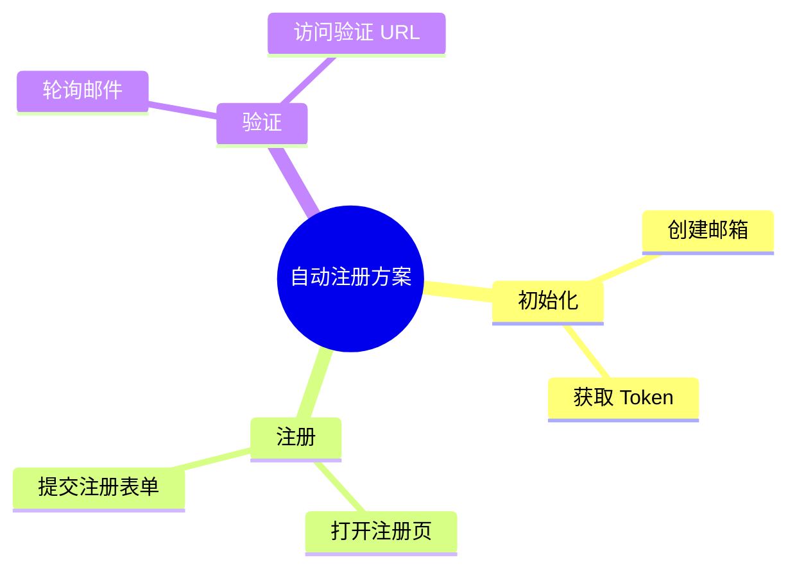

<a id="mermaid-timeline"></a>
### 9. 时间线（Timeline）

适用场景：项目里程碑、版本演进历史

源码：

```
timeline
    title 项目开发里程碑
    第1周 : 技术调研
    第2周 : 浏览器控制
    第3周 : 表单自动化
    第4周 : 发布 v1.0
```

预览图表：

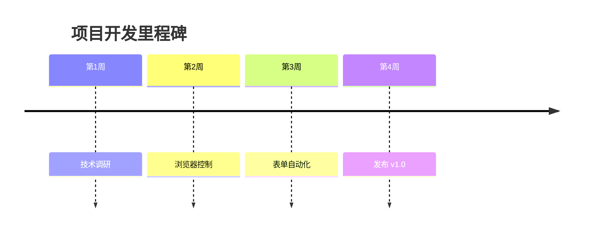

---

## 二、支持的基础 UML / PlantUML 图

> 以下图表适合通过 PlantUML 语法写入飞书画板。

### UML / PlantUML 图表速查表

| 类型 | PlantUML 形式 | 适用场景 |
|------|---------------|---------|
| [类图](#plantuml-class) | `class` | 面向对象设计、数据模型 |
| [时序图](#plantuml-sequence) | `participant` / `actor` | 调用顺序、交互流程 |
| [用例图](#plantuml-usecase) | `usecase` | 角色与功能关系 |
| [活动图](#plantuml-activity) | `start` / `if` / `stop` | 业务流程、处理步骤 |
| [状态图](#plantuml-state) | `[*] -->` | 生命周期、状态流转 |
| [组件图](#plantuml-component) | `component` / `[]` | 系统模块关系 |
| [部署图](#plantuml-deployment) | `node` | 部署结构、运行环境 |
| [对象图](#plantuml-object) | `object` | 实例关系 |
| [包图](#plantuml-package) | `package` | 模块分层、依赖关系 |
| [ER 图](#plantuml-er) | `entity` | 实体关系、表结构 |
| [组件交互 / 通信图](#plantuml-communication) | `object` + 连接关系 | 组件间交互 |
| [甘特图](#plantuml-gantt) | `[...] lasts ...` | 排期、计划 |
| [思维导图](#plantuml-mindmap) | `@startmindmap` | 脑图、知识结构 |
| [WBS 图](#plantuml-wbs) | `@startwbs` | 任务拆解 |

<a id="plantuml-class"></a>
### 1. 类图（Class Diagram）

源码：

```
@startuml
class User
class MailClient
User --> MailClient
@enduml
```

预览图表：


<a id="plantuml-sequence"></a>
### 2. 时序图（Sequence Diagram）

源码：

```
@startuml
actor User
participant Python
participant Browser
User -> Python: start()
Python -> Browser: open page
Browser --> Python: loaded
@enduml
```

预览图表：

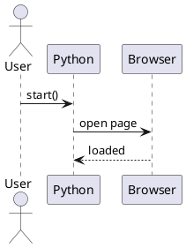

<a id="plantuml-usecase"></a>
### 3. 用例图（Use Case Diagram）

源码：

```
@startuml
actor 用户
usecase "创建账号" as UC1
usecase "完成邮箱验证" as UC2
用户 --> UC1
用户 --> UC2
@enduml
```

预览图表：

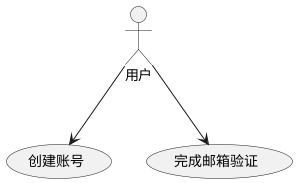

<a id="plantuml-activity"></a>
### 4. 活动图（Activity Diagram）

源码：

```
@startuml
start
:创建临时邮箱;
:打开注册页面;
if (是否收到验证邮件?) then (是)
  :访问验证链接;
else (否)
  :重试;
endif
stop
@enduml
```

预览图表：

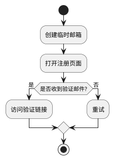

<a id="plantuml-state"></a>
### 5. 状态图（State Diagram）

源码：

```
@startuml
[*] --> 初始化
初始化 --> 注册中
注册中 --> 待验证
待验证 --> 已完成
待验证 --> 失败
已完成 --> [*]
失败 --> [*]
@enduml
```

预览图表：

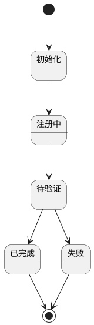

<a id="plantuml-component"></a>
### 6. 组件图（Component Diagram）

源码：

```
@startuml
[Python Worker] --> [Mail.tm API]
[Python Worker] --> [Chrome]
[Chrome] --> [Target Site]
@enduml
```

预览图表：

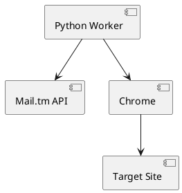

<a id="plantuml-deployment"></a>
### 7. 部署图（Deployment Diagram）

源码：

```
@startuml
node "Mac" {
  artifact "Python Script"
}
node "Chrome Browser"
cloud "Mail.tm"
cloud "Target Site"
"Python Script" --> "Chrome Browser"
"Python Script" --> "Mail.tm"
"Chrome Browser" --> "Target Site"
@enduml
```

预览图表：

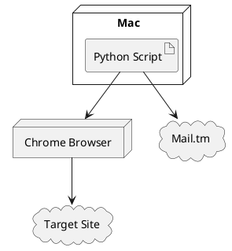

<a id="plantuml-object"></a>
### 8. 对象图（Object Diagram）

源码：

```
@startuml
object account1
object email1
account1 --> email1
@enduml
```

预览图表：

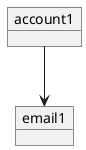

<a id="plantuml-package"></a>
### 9. 包图（Package Diagram）

源码：

```
@startuml
package core
package auth
package cli
core --> auth
cli --> core
@enduml
```

预览图表：

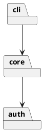

<a id="plantuml-er"></a>
### 10. ER 图（Entity Relationship）

源码：

```
@startuml
entity Account
entity Email
entity Message
Account ||--o{ Email
Email ||--o{ Message
@enduml
```

预览图表：

```plantuml
@startuml
entity Account
entity Email
entity Message
Account ||--o{ Email
Email ||--o{ Message
@enduml
```

<a id="plantuml-communication"></a>
### 11. 组件交互 / 通信图

源码：

```
@startuml
object Python
object Chrome
object Site
Python --> Chrome : 控制浏览器
Chrome --> Site : 提交表单
@enduml
```

预览图表：

```plantuml
@startuml
object Python
object Chrome
object Site
Python --> Chrome : 控制浏览器
Chrome --> Site : 提交表单
@enduml
```

<a id="plantuml-gantt"></a>
### 12. 甘特图（Gantt）

源码：

```
@startgantt
Project starts the 2026-03-20

[初始化] lasts 2 days
[注册] starts at [初始化]'s end and lasts 3 days
[验证] starts at [注册]'s end and lasts 2 days
@endgantt
```

预览图表：

```plantuml
@startgantt
Project starts the 2026-03-20

[初始化] lasts 2 days
[注册] starts at [初始化]'s end and lasts 3 days
[验证] starts at [注册]'s end and lasts 2 days
@endgantt
```

<a id="plantuml-mindmap"></a>
### 13. 思维导图（Mindmap）

源码：

```
@startmindmap
* 自动注册方案
** 初始化
** 注册
** 验证
@endmindmap
```

预览图表：

```plantuml
@startmindmap
* 自动注册方案
** 初始化
** 注册
** 验证
@endmindmap
```

<a id="plantuml-wbs"></a>
### 14. WBS 图（Work Breakdown Structure）

源码：

```
@startwbs
* 自动注册项目
** 初始化模块
** 浏览器控制模块
** 邮件验证模块
@endwbs
```

预览图表：

```plantuml
@startwbs
* 自动注册项目
** 初始化模块
** 浏览器控制模块
** 邮件验证模块
@endwbs
```
