# 飞书文档支持的图表类型

本文整理当前项目中适合写入飞书文档的图表类型，分为两部分：

- Mermaid 图表
- 基础 UML / PlantUML 图表

说明：

- Mermaid 图表通过飞书白板 API 以 Mermaid 语法导入
- UML 图表通过飞书白板 API 以 PlantUML 语法导入
- 下面示例主要用于整理可用图表类型与基础语法，不代表飞书一定支持对应语法的全部高级特性

---

## 一、Mermaid 支持的图表类型

> 以下内容整理自 [Python自动注册技术方案.md](/Users/wade/MyDocument/ScriptCode/feishu-docx/docs/Python自动注册技术方案.md) 附录部分。

### 1. 流程图（Flowchart）

适用场景：步骤流程、决策分支、系统架构

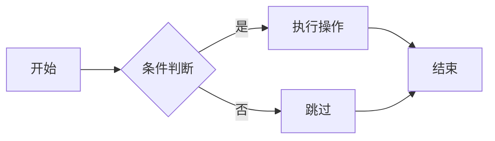

### 2. 时序图（Sequence Diagram）

适用场景：API 调用顺序、组件间交互、通信协议

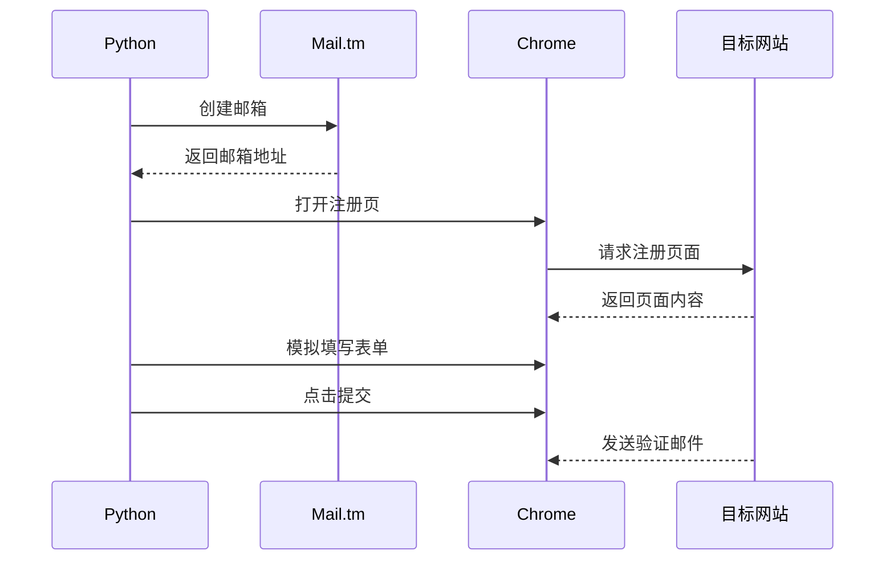

### 3. 类图（Class Diagram）

适用场景：面向对象设计、数据模型、接口定义

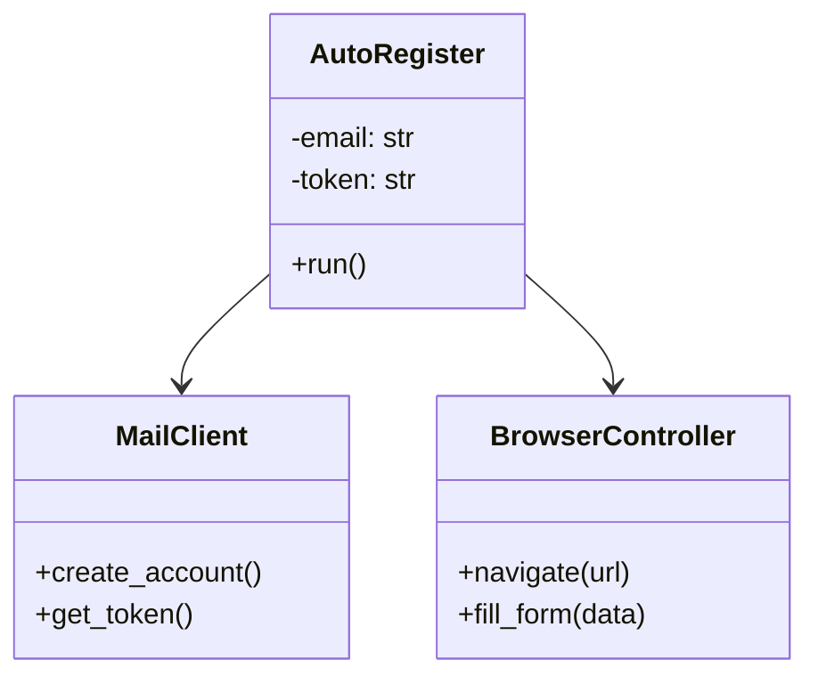

### 4. 状态图（State Diagram）

适用场景：状态机、对象生命周期、任务状态流转

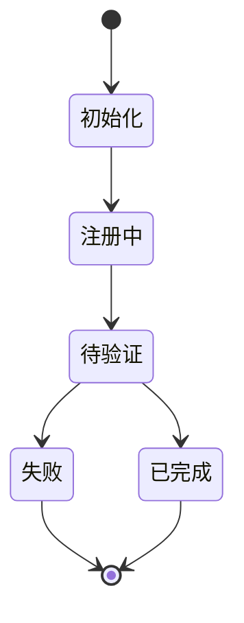

### 5. 甘特图（Gantt）

适用场景：项目排期、任务时间规划、里程碑管理

```mermaid
gantt
    title 自动注册流程耗时
    dateFormat ss
    axisFormat %S秒

    section 初始化
    创建邮箱        :a1, 00, 2s
    获取 Token      :a2, after a1, 1s

    section 注册
    打开注册页面     :b1, after a2, 3s
    模拟填写表单     :b2, after b1, 5s

    section 验证
    轮询等待邮件     :c1, after b2, 10s
```

### 6. 饼图（Pie Chart）

适用场景：比例分布、占比统计

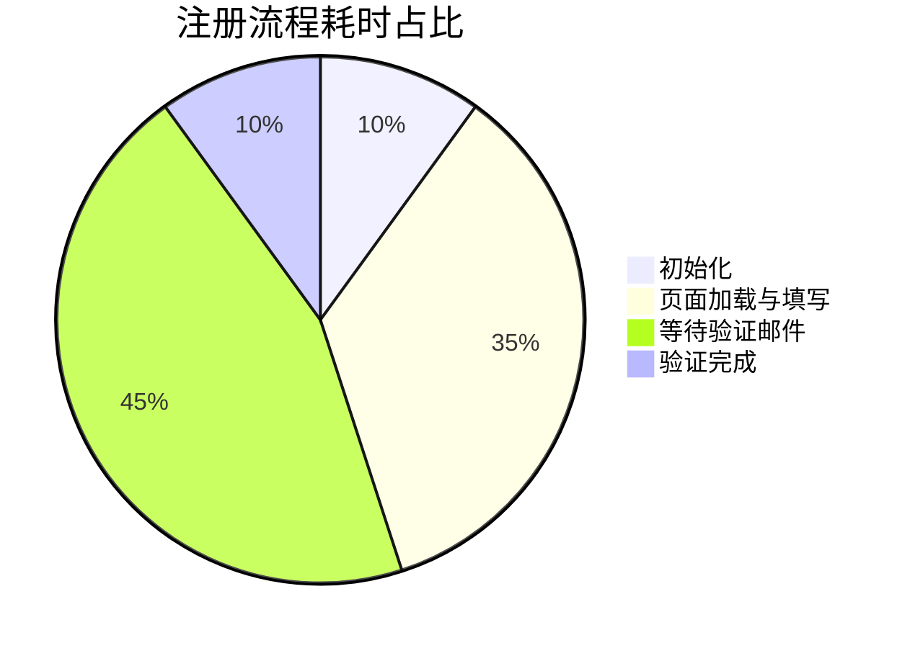

### 7. ER 图（Entity Relationship Diagram）

适用场景：数据库表关系、数据结构设计

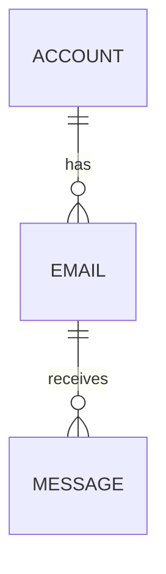

### 8. 思维导图（Mindmap）

适用场景：知识结构梳理、头脑风暴、技术拆解

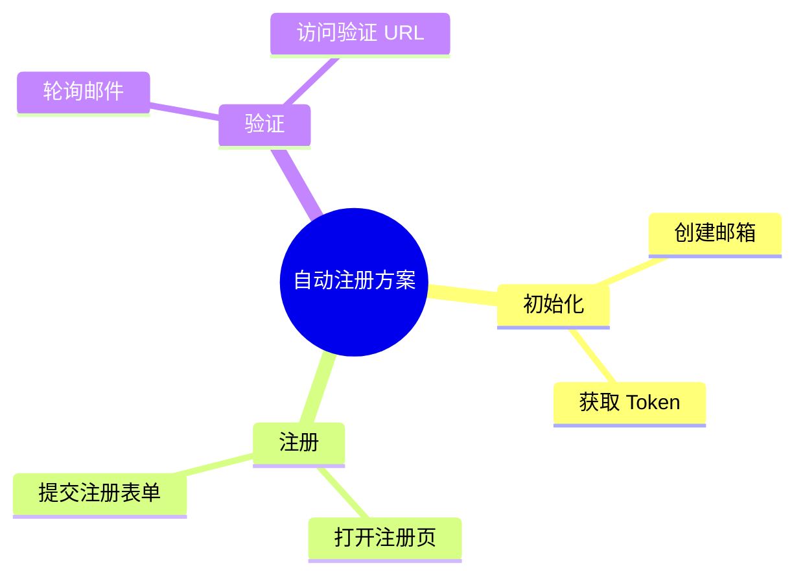

### 9. 时间线（Timeline）

适用场景：项目里程碑、版本演进历史

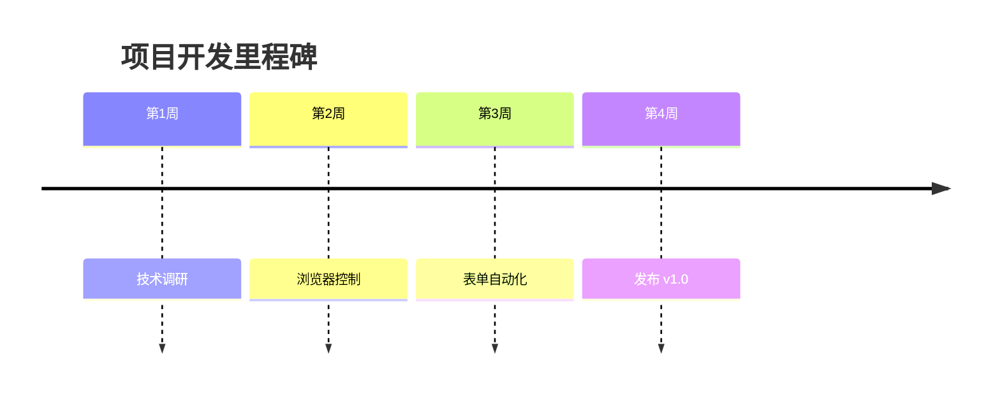

### Mermaid 图表速查表

| 类型 | 语法关键字 | 适用场景 |
|------|----------|---------|
| 流程图 | `graph` / `flowchart` | 步骤流程、决策分支 |
| 时序图 | `sequenceDiagram` | API 调用顺序、组件交互 |
| 类图 | `classDiagram` | 面向对象设计、数据模型 |
| 状态图 | `stateDiagram-v2` | 状态机、生命周期 |
| 甘特图 | `gantt` | 项目排期、时间规划 |
| 饼图 | `pie` | 比例分布 |
| ER 图 | `erDiagram` | 数据库表关系 |
| 思维导图 | `mindmap` | 知识结构、头脑风暴 |
| 时间线 | `timeline` | 里程碑、版本演进 |

---

## 二、支持的基础 UML / PlantUML 图

> 以下图表适合通过 PlantUML 语法写入飞书画板。

### 1. 类图（Class Diagram）

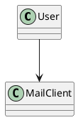

### 2. 时序图（Sequence Diagram）

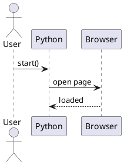

### 3. 用例图（Use Case Diagram）

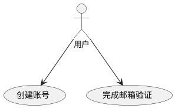

### 4. 活动图（Activity Diagram）

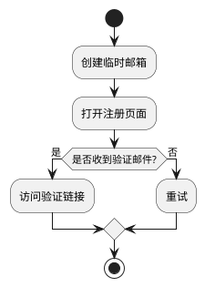

### 5. 状态图（State Diagram）

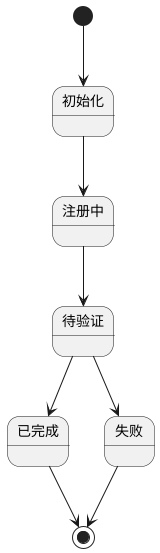

### 6. 组件图（Component Diagram）

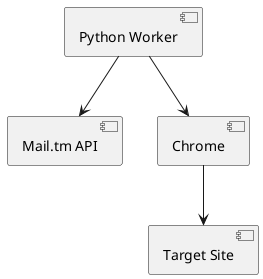

### 7. 部署图（Deployment Diagram）

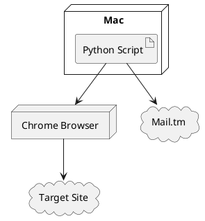

### 8. 对象图（Object Diagram）

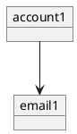

### 9. 包图（Package Diagram）

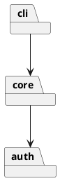

### 10. ER 图（Entity Relationship）

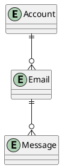

### 11. 组件交互 / 通信图

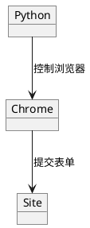

### 12. 甘特图（Gantt）

```plantuml
@startuml
[初始化] lasts 2 days
[注册] starts at [初始化]'s end and lasts 3 days
[验证] starts at [注册]'s end and lasts 2 days
@enduml
```

### 13. 思维导图（Mindmap）

```plantuml
@startmindmap
* 自动注册方案
** 初始化
** 注册
** 验证
@endmindmap
```

### 14. WBS 图（Work Breakdown Structure）

```plantuml
@startwbs
* 自动注册项目
** 初始化模块
** 浏览器控制模块
** 邮件验证模块
@endwbs
```

### UML / PlantUML 图表速查表

| 类型 | PlantUML 形式 | 适用场景 |
|------|---------------|---------|
| 类图 | `class` | 面向对象设计、数据模型 |
| 时序图 | `participant` / `actor` | 调用顺序、交互流程 |
| 用例图 | `usecase` | 角色与功能关系 |
| 活动图 | `start` / `if` / `stop` | 业务流程、处理步骤 |
| 状态图 | `[*] -->` | 生命周期、状态流转 |
| 组件图 | `component` / `[]` | 系统模块关系 |
| 部署图 | `node` | 部署结构、运行环境 |
| 对象图 | `object` | 实例关系 |
| 包图 | `package` | 模块分层、依赖关系 |
| ER 图 | `entity` | 实体关系、表结构 |
| 通信图 | `object` + 连接关系 | 组件间交互 |
| 甘特图 | `[...] lasts ...` | 排期、计划 |
| 思维导图 | `@startmindmap` | 脑图、知识结构 |
| WBS 图 | `@startwbs` | 任务拆解 |
